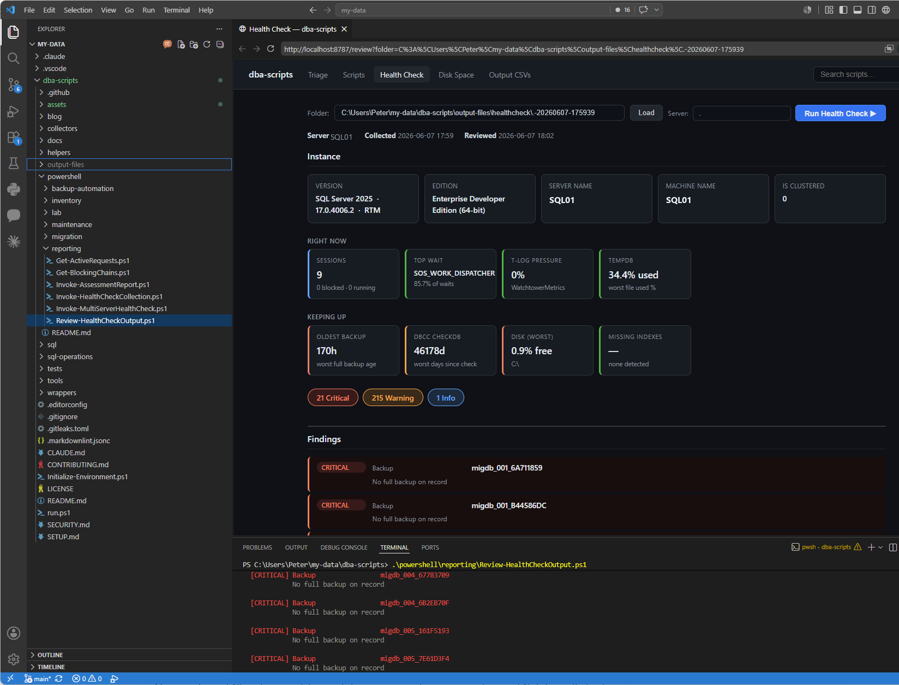
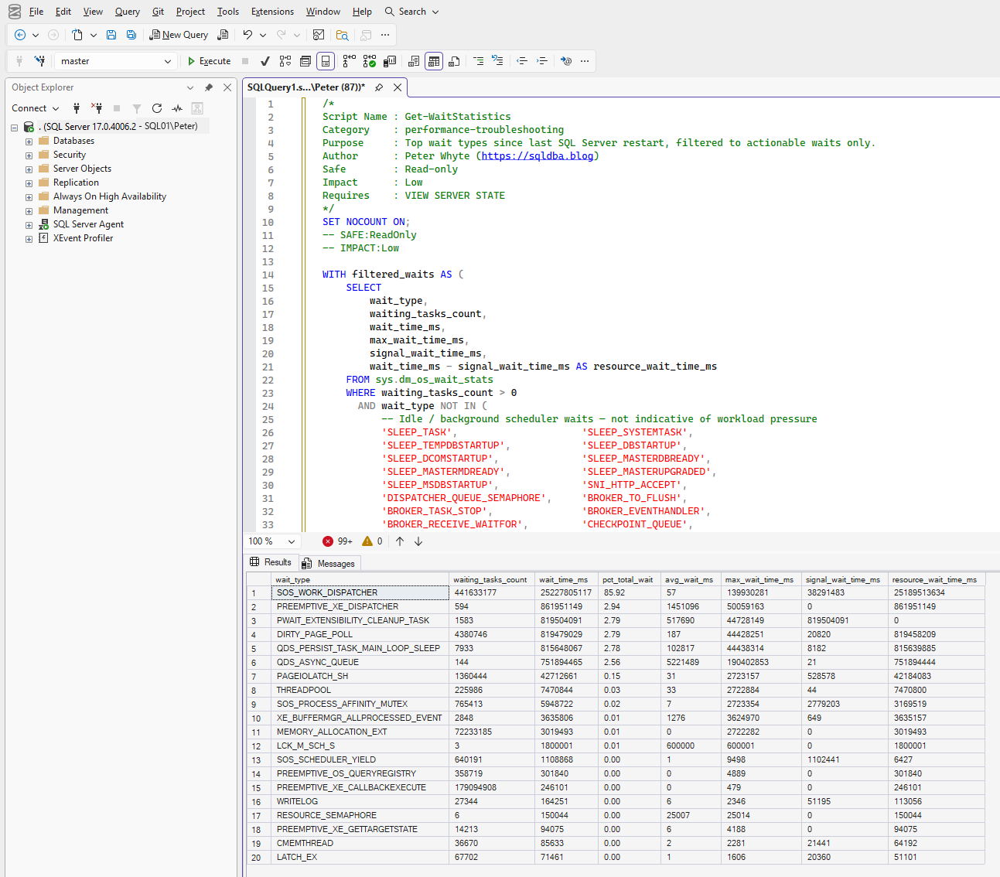

<p align="center">
  
</p>

<h3 align="center">SQL Server Health, Reviewed by AI — Collection, Dashboard, and Copy/Paste Scripts for Production DBAs</h3>

<p align="center">
  <a href="https://github.com/peterwhyte-lgtm/dba-tools"></a>
  <a href="LICENSE"></a>
  <a href="https://github.com/peterwhyte-lgtm/dba-tools/commits/main"></a>
  <a href="https://sqldba.blog"></a>
</p>

---

## What This Is

I'm Peter Whyte — production SQL Server DBA, running [sqldba.blog](https://sqldba.blog). This is the toolkit I actually use, and it's built around one idea: **collect everything a DBA looks at on a server, then have an AI review it with you.**

The core workflow is three steps. A health check collection runs 39 diagnostic scripts against an instance and saves each result as a CSV. A rules review turns those CSVs into deterministic CRITICAL / WARNING / INFO findings. Then an AI assessment reads the whole collection and does what fixed thresholds can't — correlates findings across the CSVs into root causes and writes a prioritized report with evidence and a fix for each issue. It's a second reviewer that has read every output, doesn't get tired, and surfaces the blindspots you'd miss at 2am.

Underneath that sits everything else a production DBA needs, usable on its own:

- **170+ SQL scripts** you open and paste directly into SSMS — no parameters, no magic variables, no install
- **PowerShell wrappers** that run the same scripts from the terminal and export CSVs
- **A local web UI** where collections are viewed, verified, and diagnosed — health scorecard, security drill-down, disk capacity, AI reports, live incident triage
- **Runbooks, change orders, and a migration toolkit** for the planned work when there's time to do it right

Every script came from a real situation: an incident, a migration window, a client handover, or a routine check that needed to be fast and safe. It runs against localhost by default, a named instance when you pass one, or a server list via the multi-server scripts.

Everything is read-only by default. Every script has a header with what permissions it needs and what it touches. Nothing phones home, nothing requires a framework — and nothing is sent to any AI until you run the assessment step yourself.

### See It Work

<p align="center">
  <a href="https://sqldba.blog/wp-content/uploads/2026/07/dba-tools-demo.mp4"></a>
</p>

<p align="center"><em>A 30-second run: <code>Get-WaitStatistics</code> from the terminal, the same output in the web UI, then the script pasted into SSMS and run. (<a href="https://sqldba.blog/">see it on sqldba.blog</a>)</em></p>

---

## Start Here

Clone the repo and run the setup script. This assumes a local SQL Server is installed, no flags needed:

```powershell
git clone https://github.com/peterwhyte-lgtm/dba-tools
cd dba-tools
.\Initialize-Environment.ps1
```

This checks PowerShell version, installs the SqlServer module if missing, creates output directories, and verifies the connection. Pass or fail, it tells you exactly what to do next.

<p align="center">
  
</p>

To target a remote or named instance instead, pass `-ServerInstance`:

```powershell
.\Initialize-Environment.ps1 -ServerInstance PROD01\SQL2025
```

Once setup passes, the server is saved for the session and every script picks it up automatically — no `-ServerInstance` flag needed on each run.

> Full prerequisites and troubleshooting: [SETUP.md](SETUP.md)

---

## The Health Check — Collect, Review, AI-Assess

The flagship workflow. Three commands take a server from "no idea" to a prioritized written assessment:

```powershell
.\powershell\reporting\Invoke-HealthCheckCollection.ps1 -ServerInstance PROD01\SQL2025   # 1. collect
.\powershell\reporting\Review-HealthCheckOutput.ps1                                      # 2. rules review
.\powershell\reporting\Invoke-AiAssessment.ps1                                           # 3. AI assessment
```

<p align="center">
  
  <br><em>Review-HealthCheckOutput — CRITICAL / WARNING / INFO findings across the instance</em>
</p>

**Step 1** collects 39 scripts in a single pass — backups, waits, blocking, memory, disk, security surface area, agent jobs, integrity checks, and more — into one timestamped folder of CSVs.

**Step 2** applies fixed rules: missing or stale backups, databases not online, stale DBCC CHECKDB, suspect pages, sa enabled, percent-based autogrowth, unconfigured max server memory, I/O latency above threshold, transaction log pressure, high VLF count, maintenance job failures.

**Step 3** is the point of the collection. The AI reads every CSV and correlates what the rules can't: the missing index findings that line up with the top CPU queries, the autogrowth history that explains the VLF count, the weak login that's also a sysadmin. The output is a written report — verdict, priority issues with evidence and a fix for each, security posture, watch list — saved to `output-files\assessments\`.

Two ways to run the AI step, both driven by the same rubric:

- **Claude Code in your editor** — open the repo, sign in, and ask for a health assessment. No key handling.
- **The API script** — `Invoke-AiAssessment.ps1`, scriptable and schedulable. Works with a personal key at home or a corporate key/gateway at work; nothing account-related is stored in the repo. `-DryRun` writes the exact prompt to a file without calling any API, so a corporate review can see byte-for-byte what would be sent.

Setup for both paths, including the corporate data-review question: [docs/ai-assessment.md](docs/ai-assessment.md)

For a client handover or ownership review, there's also a scored markdown report with no AI dependency:

```powershell
.\powershell\reporting\Invoke-AssessmentReport.ps1 -ServerInstance PROD01\SQL2025 -AssessedBy "Peter Whyte"
```

---

## The Web UI — View, Verify, Diagnose

A local browser dashboard where collection output is viewed and signed off. One Collect action feeds every page:

```powershell
.\web-ui\Start-WebUi.ps1
# Opens at http://localhost:8787
```

<p align="center">
  
  <br><em>VS Code terminal (bottom) running Start-WebUi.ps1, browser UI (top) — browse scripts by category, search, and run against any instance</em>
</p>

- **Health Check** — scorecard with severity and category filters, plus a findings delta against the previous collection: what's new, what's resolved
- **Security** — surface area and access-risk vitals with three-level drill-down, from a count to the CSV rows to remediation T-SQL
- **Disk** — capacity through two lenses: % used worst-first across all databases, and the top databases by absolute size
- **AI Assessment** — read reports in the browser, or run a new assessment from a panel
- **Triage** — a live incident cockpit: run diagnostic scripts and see results inline, mid-incident
- **Scripts** — the browse/reference library for the whole repo

Runs on `localhost:8787` only. The server itself has no external dependencies; the browser chart view loads Chart.js from a CDN. The UI is optional: every workflow above works from the terminal alone. A multi-server fleet dashboard is on the roadmap.

---

## SQL Scripts — Open, Copy, Paste, Run

Browse `sql/` and copy directly into SSMS. No parameters, no magic variables, no install. Every script is a single result set.

<p align="center">
  
  <br><em>Open any script from sql/ — paste into SSMS — run</em>
</p>

| Category | What you get |
|----------|-------------|
| [`sql/performance/`](sql/performance/) | Wait stats, blocking chains, active requests, long queries, missing indexes, deadlocks, plan cache, heaps, unused indexes |
| [`sql/monitoring/`](sql/monitoring/) | Instance config score, database health, TempDB, memory, MAXDOP, SQL Agent jobs, disk, VLF count, autogrowth history |
| [`sql/backups/`](sql/backups/) | Coverage by database, history, backup age, encryption status, restore duration estimates |
| [`sql/security/`](sql/security/) | Sysadmin members, login audit, orphaned users, weak logins, linked server security, database permissions |
| [`sql/migration/`](sql/migration/) | Risk assessment, compatibility audit, deprecated features, login inventory, DDL generators |
| [`sql/high-availability/`](sql/high-availability/) | AG replica health, sync state, latency, readable secondary usage |
| [`sql/maintenance/`](sql/maintenance/) | Generate backup jobs, index maintenance jobs, housekeeping DDL, maintenance job status |

Full list with descriptions: [docs/script-catalog.md](docs/script-catalog.md)

---

## PowerShell — Run From The Terminal, Save To CSV

The same scripts, callable by name from any directory. No paths, no module dependencies beyond the SqlServer module.

```powershell
# Run any script by name — fuzzy match. Results always saved to output-files/ as CSV.
.\run.ps1 Get-WaitStatistics
.\run.ps1 Get-BlockingChains -ServerInstance PROD01\SQL2025
.\run.ps1 Get-BackupCoverage -OutputFormat Csv  # CSV only, no terminal output

# Set a server once for the session — every script picks it up
.\tools\local-sql\Set-SqlConnection.ps1 -ServerInstance PROD01\SQL2025
.\run.ps1 Get-WaitStatistics
```

<p align="center">
  
  <br><em>.\run.ps1 — resolves any script by name, outputs to terminal or CSV</em>
</p>

---

## Operational Runbooks

`docs/ops/` covers the planned work — the things you need to get right before and during a maintenance window, not the things you're diagnosing in the moment.

**Change orders** — CAB-ready approval documents for version upgrades, server migrations, and AG failovers. Pre/post checks and rollback criteria included.

**Execution checklists** — step-by-step guides for AG cluster migration, standalone server replacement, DR failover, and SQL version upgrades. Written for the person executing, not the person reviewing.

**Runbooks** — full playbooks covering standalone migration, AG cluster migration, OS upgrade, edition change, and version upgrade. What to do, in what order, with decision points for when things go sideways.

**Change templates** — SQL for TDE, CDC, mirroring, AG configuration, statistics maintenance, DBCC patterns, and patching. Copy the template, fill in the variables, review before executing.

### Migration Toolkit

Run against the source server before a migration window:

```powershell
# Pre-migration risk scan — HIGH/MEDIUM/INFO findings across compat, features, logins, config
.\powershell\migration\Invoke-PreMigrationAssessment.ps1 -ServerInstance PROD01\SQL2025

# Capture baseline metrics for before/after comparison
.\powershell\migration\Export-MigrationBaseline.ps1 -ServerInstance PROD01\SQL2025 -Label pre
```

Covers: compatibility gaps, deprecated features in active use, edition-only features, linked server dependencies, AG membership, login inventory with migration risk, post-migration validation checklist.

---

## Requirements

| | Minimum | Recommended |
|-|---------|-------------|
| SQL Server | 2016 (13.x) | 2019+ |
| PowerShell | 5.1 | 7+ (required for parallel multi-server scripts) |
| SQL execution | `sqlcmd.exe` on PATH | SqlServer module (`Invoke-Sqlcmd`) |
| Permissions | `VIEW SERVER STATE`, `VIEW ANY DATABASE` | Same |

```powershell
Install-Module -Name SqlServer -Scope CurrentUser -Force
```

The AI assessment step additionally needs either Claude Code (signed in) or an `ANTHROPIC_API_KEY` — see [docs/ai-assessment.md](docs/ai-assessment.md). Everything else runs fully local.

---

## Contributing

See [CONTRIBUTING.md](CONTRIBUTING.md). This is Peter's toolkit — contributions are welcome, but scope and direction are his call. Scripts must be read-only, single result set, and include the standard header.

---

<p align="center">
  <a href="https://sqldba.blog">sqldba.blog</a> — each script has a companion post with real-world context
  <br><br>
  Built and maintained by <a href="https://sqldba.blog">Peter Whyte</a> &nbsp;·&nbsp; <a href="LICENSE">MIT</a>
</p>
